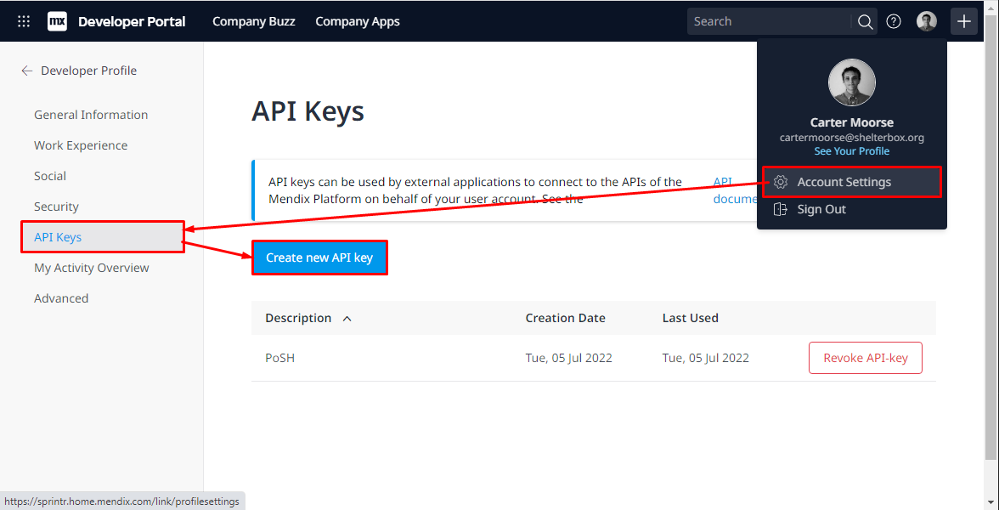
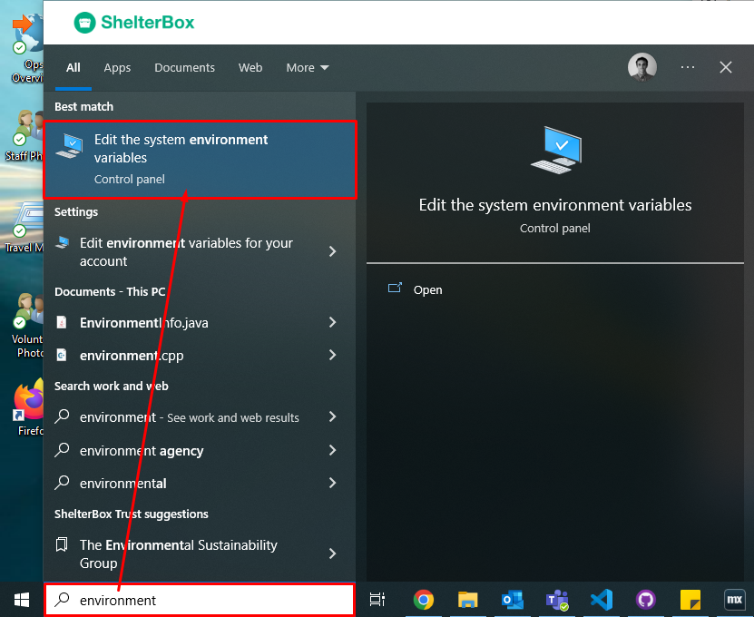
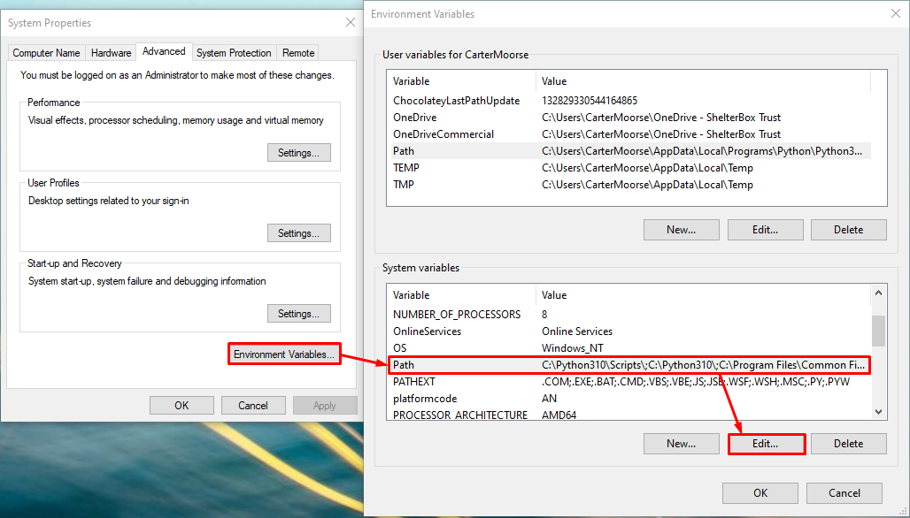
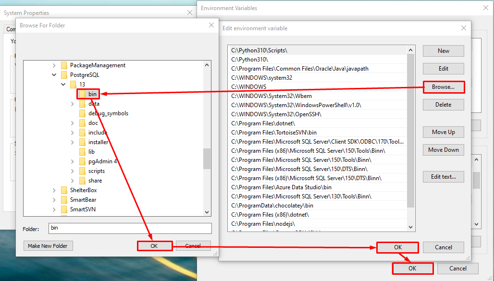
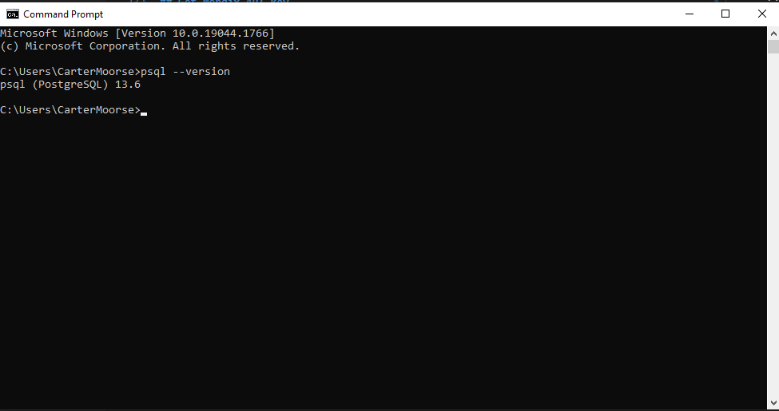

# MxDB2Local
PowerShell script to replicate Mendix cloud database to local Postgres database

## Prerequisites
 - Make sure you have [Postgres](https://www.postgresql.org/download/windows/) installed
 - Make sure to add Postgres command line tools to your PATH [(?)](#add-postgres-command-line-tools-to-your-path)

## How to use
 1. Run `MxDB2Local.ps1` PowerShell script
 2. Enter PostgresSQL username (default: postgres) *
 3. Enter PostgresSQL password *
 4. Enter Mendix username/email *
 5. Enter Mendix API key [(?)](#get-mendix-api-key) *
 6. Select the app
 7. Select the environment
 8. Select the snapshot
 9. Bask in the glory!

*\* Only required when running for the first time*

---

## Get Mendix API key
 1. Login to [Mendix Developer portal](https://sprintr.home.mendix.com/link/profilesettings/apikeys)
 2. Click profile image at top > Account settings > API Keys > Create new API key 
 3. Give it a friendly description > Generate API key
 4. Copy the key and paste into the script prompt

## Add Postgres command line tools to your PATH
 1. Windows > Search "Environment" > Edit the system environment variables 
 2. Environment Variables... > Select Path under 'System variables' > Edit... 
 3. Browse... > Select the `/bin` folder of your Postgres installation > OK on all previous Windows (eg `C:\Program Files\PostgreSQL\13\bin`) 
 4. Open Command Prompt and try running `psql --version`. It should return like below 
